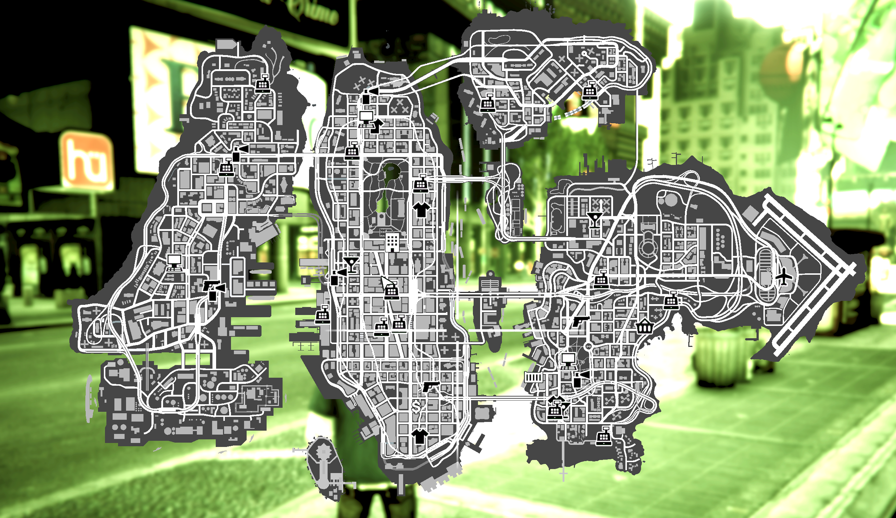

# Liberty_City_Emergency_Map_Blips
Standalone File Replacement Created By - DodgergamingJR

## Features
* Restores GTA V's Map Design

## Installation

- Download File by Clicking Code (In Green) and Click Download Zip
- Unzip File
- Launch OpenIV and go to - mods\update\x64\dlcpacks\liberty_city\dlc.rpf\x64\data\cdimages\liberty_city_scaleform.rpf\
- Make sure you are in EDIT MODE and Drag and drop the 2 files from the "Original GTA V Map Design" Folder into OpenIV
- Replace Any Files

## Uninstall
- Launch OpenIV and go to - mods\update\x64\dlcpacks\liberty_city\dlc.rpf\x64\data\cdimages\liberty_city_scaleform.rpf\
- Make sure you are in EDIT MODE and Drag and drop the 2 files from the "Restore Back To Coloured Map Design Installed From World Travel Liberty City" Folder into OpenIV
- Replace Any Files

# Example Images

