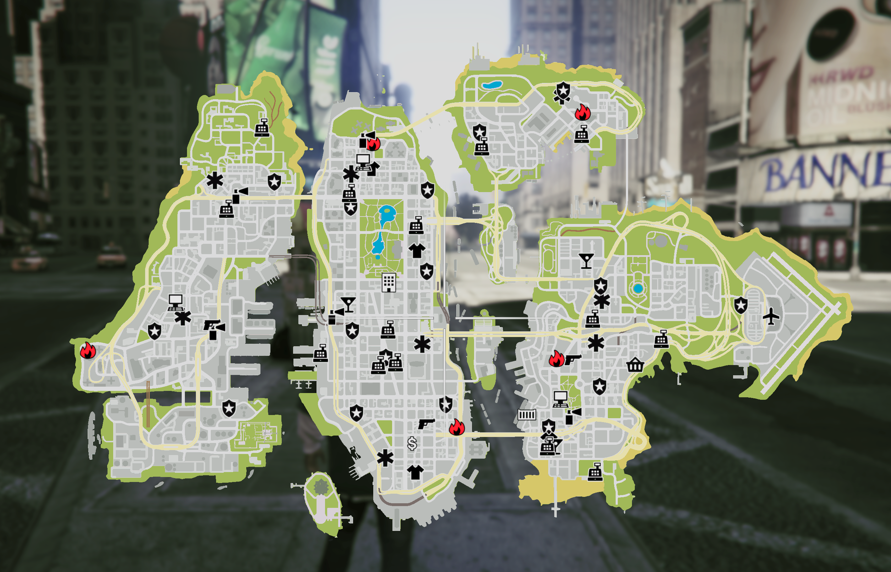

# Liberty_City_Singleplayer_Map_Designs

## Features
* Liberty City Colour Map
* Liberty City Grey Map

## Installation Automatically - OIV

- Download Zip
- Unzip File
- Launch OpenIV - Click Open Package Installer
- Go to directory where the unzipped download is
- Open Folder Of Chosen Map Design
- Open Automatic Installation - OIV Folder
- Open the OIV File
- Click Install
- Make sure to select location to install as the "mods" folder
- Once Installed Successfully close Package installer window
- Launch GTA V

## Installation Manually 

- Download Zip
- Unzip File
- Launch OpenIV and go to - mods\update\x64\dlcpacks\liberty_city\dlc.rpf\x64\data\cdimages\liberty_city_scaleform.rpf\
- Make sure you are in EDIT MODE and Drag and drop the 2 gfx files from your chosen map design manual install folder 
- Replace Any Files
- Disable Edit Mode In OpenIV 
- Launch GTA V

# Example Images
# Liberty City Grey Map

# Liberty City Colour Map

## Credits
- Original Map Design - World Travel Team 
